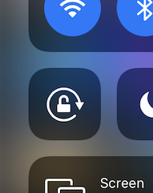

# Imperfect VR 

This is a collection of examples for my **Imperfect VR** workshop, built with [A-Frame](https://aframe.io/).

[The Imperfect VR Manifesto](https://github.com/crcdng/imperfect-vr/blob/master/Imperfect%20VR%20Manifesto.pdf) - [Github Repository](https://github.com/crcdng/imperfect-vr) - [See it online](https://crcdng.github.io/imperfect-vr/)

## 2025 update

I have been updating this project for more than 10 years, moving along with the great people who make A-Frame, and who are still going as well. Imperfect VR was born as a labor of love, as part of my Phd, and as a practical, constructive protest against Virtual Reality being occupied by Big-Tech and High-Tech-Bros arguing for the latest, expensive Hardware. While the interest in this kind of "low tech / high empowerment" approach towards VR has declined, I am still testing every update in cardboard viewers with crappy Android phones. I just activated sponsorship for the project, in case someone wants to support this idea. 

## 2023 update

*Does low-tech, DIY, Cardboard VR still work in 2023?* 

While billions are invested in corporate Metaverses and the "AR will save everything" dogma is still around 15 years after I heard it, I believe more than ever in punk, grassroots, low tech **Imperfect VR** as described below. The premise was always that people bring their own phones, put them into a cardboard viewer and become hackers and creators of they own metaverses. With shifting WebXR standards and A-Frame having [dropped cardboard mode](https://aframe.io/blog/aframe-v1.4.0/), I wanted to find out if it is still possible in March 2023.
 
* [A-Frame](https://aframe.io/) is still updated with individual [components](https://github.com/c-frame) maintained by the community 
* Android works in a cardboard viewer. I tried an Motorola Moto G8 plus Android 10 device. Confirm permissions and install Google VR Services. It shows VR / AR buttons. I could get into VR. Note that you need to use SSL ("https:") on the server to get access to VR mode. 
* iPhone doesn't work. We had to deal with workarounds on the iPhone since 2016. Now it seems Game Over. I tried iPhone SE with Safari, Chrome, Firefox and even the "XR Viewer" from Mozilla. All I got was fullscreen browser mode. At least you can use the iPhone as a 3D viewer, access to the sensors work again, and the 3D Models are located in VR space when you move the phone.  

This means there is still hope.

## What is Imperfect VR

Imperfect VR means that we create our own virtual realities, not aiming for perfection but rather seeking fun and meaning in virtual spaces. Cheap 3D assets. Blocky textures. Weird sounds. Queer social places. Forget VR mainstream. Let’s rather meet and stumble around with smartphones strapped to our faces. 

This workshop is based on the premise that everyone who can slide a smartphone into a [Cardboard](https://vr.google.com/cardboard/) can make VR experiences, even if you haven't written a single line of code before.

Imperfect VR is inspired by ["Imperfect Cinema"](http://www.imperfectcinema.com/) by Allister Gall which in turn is inspired by the essay ["For an imperfect cinema"](http://www.ejumpcut.org/archive/onlinessays/JC20folder/ImperfectCinema.html) by Julio García Espinosa.

It was part of my practice-based PhD "Designing Playful Systems" https://www.crcdng.com/static/pdf/MS_ImperfectVR.pdf.

## The VR scenes for the workshop

* **00 Do it Yourself** - the scene for our coding exercise
* **01 Hello VR World** - result of our coding exercise: https://crcdng.github.io/imperfect-vr/01_hello_vr_world
* **02 360 Image** demonstrates a 360 image: https://crcdng.github.io/imperfect-vr/02_360_image
* **03 360 Video** demonstrates a 360 video: https://crcdng.github.io/imperfect-vr/03_360_video
* **04 Basic Scene**, based on the original A-Frame documentation [Build a Basic Scene](https://aframe.io/docs/1.0.0/guides/building-a-basic-scene.html). It has animation, gaze-based interaction (looking at the cube will make it react) and sound: https://crcdng.github.io/imperfect-vr/04_basic_scene
* **05 Imperfect Treasures**, based on the original Google Cardboard example scene. This is similar to the last scene, but has a little bit more logic (code) in it to create a little playful experience: https://crcdng.github.io/imperfect-vr/05_imperfect_treasures
* **06 The Reality of the Virtual** featuring Slavoj Žižek, Paul Virilio, Nyan Cat and more. Still a variant of or first "Hello World" scene, with more interaction, more Dubstep, more meaning, more everything: https://crcdng.github.io/imperfect-vr/06_reality_of_the_virtual
* **07 Rabbit, Chicken, AK 47** (teaser). This scene is my playground for more experimentation with storytelling and movement in VR. Expect it to be ... imperfect: https://crcdng.github.io/imperfect-vr/07_rabbit_chicken_ak47

## Some technical and not so technical remarks

[A-Frame](https://aframe.io/) is a beginner-friendly, but capable open source framework made by people from Mozilla. It allows creating Virtual Reality experiences from HTML markup and JavaScript code. It is based on an entity-component-system architecture and has a friendly and growing community. We also use cardboard VR viewers along with our own phones.

Each example scene in this repository is self-contained and has all the files it needs in its directory structure (including fonts, images, and movies).

Everything we use in the workshop is open source. But the environment is changing and the idea of an "open web" is in danger of being superseded again by commercial monopolies.

In (utopical) theory, Virtual Reality on the Web (also called WebVR) would be an open platform on which we can build the next [Metaverse](https://en.wikipedia.org/wiki/Metaverse) together. In practice, a few gatekeepers push against it. There is not so much money to make and it is outside of their gated communities (this happen to be the same entities that run  App stores). Both Google and Apple constantly invent new and different rules about what is appropriate on the browser and implements them without asking. Google blacklists devices and sometimes tries to install "services" as soon as you open a WebVR page. Apple just decided to break WebVR completely by switching off the sensors for Safari. 

**If you use an iPhone (1) make sure that the screen rotates (rotation lock is off).** 

**(2) You might see 2 or 3 pop-ups asking for sensor / motion access.**  

These developments complicate things but I am not ready to give up and leave VR to the walled gardens of tech companies. While WebVR also runs on platforms like HTC Vive or Oculus Rift (on Firefox or Supermedium), the very idea behind it is that anyone can slide their mobile phone into a cardboard - that you can build yourself as well if you want - and off you go. You also don't need someone like Facebook to "curate the platform". In practice that does work more or less and against certain resistance, as mentioned above.

What does this mean?

We have to become more knowledgeable in some not so exciting technical areas and spend much time with icky workarounds. Time we could rather use for creating exciting new worlds or for discussing Baudrillard's simulation theory (you decide).

A few pointers:

* You must run the scene from a web server and it must be secured with SSL (Address starts with "https", not with "http"). This means you must know how to install a SSL certificate either on your local laptop or on a public server. [Let’s Encrypt](https://letsencrypt.org) for public servers or [self-signed certificates](https://devcenter.heroku.com/articles/ssl-certificate-self) for private LANs are solutions to try. If you use [Github pages](https://pages.github.com) or [Glitch](https://glitch.com) for testing your scenes, this is done for you.
* To enter the fullscreen VR mode you also must push the little VR symbol. Sometimes getting into full screen mode is still difficult.
* Scenes with audio or video have a "Start" button that must push before you enter VR. 
* When you open a scene on your mobile phone phone there is a mechanism to add it to the home screen and then start it from there. This can help to solve some issues.

The main scene used to navigate to the individual scenes currently only makes sense for viewing the scenes on a desktop browser where you can go back and forth without interruption. The upcoming [Web XR Specification](https://immersive-web.github.io/webxr/) will hopefully allow to implement [portals](https://aframe.io/docs/0.9.0/components/link.html).

## Context and Plans

What I am aiming at are different formats - Imperfect VR jams and Imperfect VR workshops. The workshops are geared towards beginners - starting without any assumption about your background or coding experience. We go through the absolute basics, while advanced participants can get support to realize their ideas. We also discuss current politics of VR, perception, imperfection and a bit of Nietzsche.

A full day or two day workshop would be an option for teaching JavaScript, components etc.

The jams can be like hackathons, or game jams, people coming together for a day or a weekend and creating stuff together. Now that we are all virtual and distanced, new online workshop formats are needed.

The spirit of all this is captured in the [The Imperfect VR Manifesto](https://github.com/crcdng/imperfect-vr/blob/master/Imperfect%20VR%20Manifesto.pdf).  

*Now make a VR!*

## Third-Party Licenses

* A-Frame: Copyright (c) A-Frame Authors, MIT License
* Uses [k-frame components](https://supermedium.com/superframe/): Copyright (c) 2016 Kevin Ngo, MIT License
* see also the README's and third-party-licenses in some of the examples.
